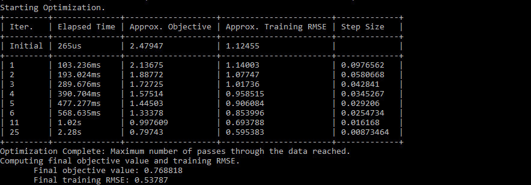
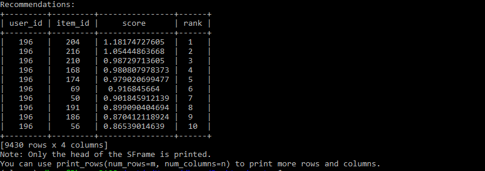

# Recommender System

 This is a recommender engine which recommends best movie for given user from the [MovieLens](https://grouplens.org/datasets/movielens/) data set.
* I have used [100K](https://grouplens.org/datasets/movielens/100k/) dataset provided by [MovieLens](https://grouplens.org/datasets/movielens/) for testing and training purposes.
* This dataset provides 100,000 ratings (1-5) from 943 users
on 682 movies.
* Each user has rated at least 20 movies.
* I have used [Graphlab-Create](https://pypi.python.org/pypi/GraphLab-Create) and [Scikit Learn](http://scikit-learn.org/stable/) as Machine Learning libraries.
* Recommendation works using **item-item similarity** based method that ranks an item according to its similarity to other items observed for the user in question.

## Recommendation images

